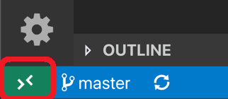
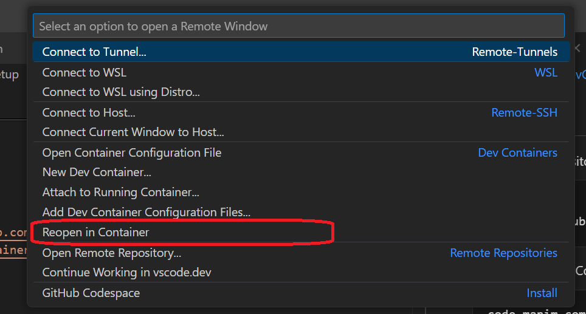

# Intro
DevContainer setup for the Manim Community Version. 

## Requirements
- [Visual Studio Code (VS Code)](https://code.visualstudio.com)
- [Docker](https://www.docker.com/products/docker-desktop/)
- [VS Code DevContainer extension](https://marketplace.visualstudio.com/items?itemName=ms-vscode-remote.remote-containers)


## Setup 

1. Clone repository
```sh
git clone https://github.com/MasterpieceTechVideos/manim_community_devcontainer.git
```

2. Open in VS Code
```sh
code manim_community_devcontainer
```

3. "Reopen in Container"

    1. Click "Open a Remote Window" button at the bottom left corner of VS Code.

    

    
    2. Select "Reopen in Container" option

    


